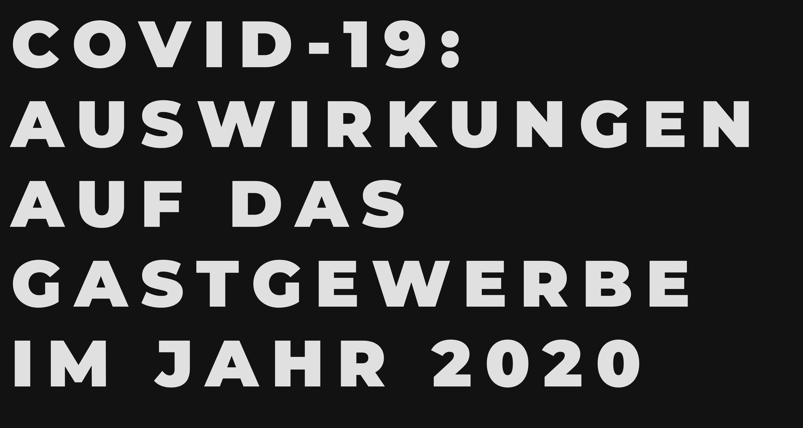
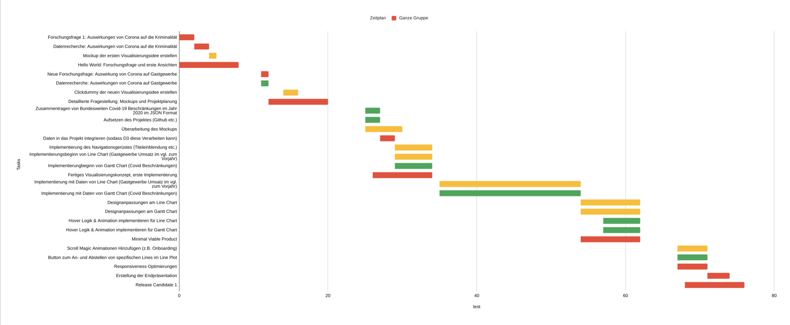

<!-- [![Contributors][contributors-shield]][contributors-url]
[![Forks][forks-shield]][forks-url]
[![Stargazers][stars-shield]][stars-url]
[![Issues][issues-shield]][issues-url]
[![MIT License][license-shield]][license-url] -->


<!-- TABLE OF CONTENTS -->
<details open="open">
  <summary><h2 style="display: inline-block">Table of Contents</h2></summary>
  <ol>
    <li>
      <a href="#about-the-project">About The Project</a>
      <ul>
        <li><a href="#all-required-tools">All required tools</a></li>
      </ul>
    </li>
    <li>
      <a href="#getting-started">Getting Started</a>
      <ul>
        <li><a href="#prerequisites">Prerequisites</a></li>
      </ul>
    </li>
    <li><a href="#usage">Usage</a></li>
    <li><a href="#Milestones">Milestones</a></li>
    <li><a href="#roadmap">Roadmap</a></li>
    <li><a href="#contributing">Contributing</a></li>
    <li><a href="#license">License</a></li>
    <li><a href="#contact">Contact</a></li>
    <li><a href="#acknowledgements">Acknowledgements</a></li>
  </ol>
</details>

<!-- CONTRIBUTING -->
## Contributer

This [course](https://www.medien.ifi.lmu.de/lehre/ws2021/iv/) is a group project offered by LMU. All group members participating in this project all listed below

1. [Mustafa Yasin](https://github.com/MustafaYasin): MY
2. [Julian Preissing](https://github.com/allach): JP
3. [Bilal Ayech](https://github.com/BilelAyech): BA
4. [Julian Lorenz](https://github.com/Julianlrn): JL
5. [Richard Hofmann](https://github.com/richardhofmann2711): RH

<!-- ABOUT THE PROJECT -->
## About The Project




### All required tools
These tools are needed so far. They will updated obviously, since the project isn't done yet.

* [JavaScript](https://www.javascript.com/)
* [D3.js](https://d3js.org/)
* [ScrollMagic](https://github.com/janpaepke/ScrollMagic)


<!-- GETTING STARTED -->
## Getting Started

To get a local copy up and running follow these simple steps.

### Prerequisites

* Python 3
  ```sh
  sudo apt install python3
  ```

<!-- USAGE EXAMPLES -->
## Usage
1. Clone the repo
   ```sh
   git clone https://github.com/MustafaYasin/infovis.git
   ```
2. Cd into directory
   ```sh
   cd infovis/webpages
   ```
2. Run the python server on localhost port 8000
   ```sh
   python3 -m http.server
   ```

<!-- Time Plan -->
## Milestones

| Milestone                                                                           | Start Date | End Date   | Publisher    |
|-------------------------------------------------------------------------------------|------------|------------|--------------|
| Forschungsfrage 1: Auswirkungen von Corona auf die Kriminalität                     | 12.11.2020 | 14.11.2020 | Ganze Gruppe |
| Datenrecherche: Auswirkungen von Corona auf die Kriminalität                        | 14.11.2020 | 16.11.2020 | Ganze Gruppe |
| Mockup der ersten Visualisierungsidee erstellen                                     | 16.11.2020 | 17.11.2020 | JL & JP      |
| Hello World: Forschungsfrage und erste Ansichten                                    | 10.11.2020 | 18.11.2020 | JL & JP      |
| Neue Forschungsfrage: Auswirkung von Corona auf Gastgewerbe                         | 23.11.2020 | 24.11.2020 | JL           |
| Datenrecherche: Auswirkungen von Corona auf Gastgewerbe                             | 23.11.2020 | 24.11.2020 | RM, BA, MY   |
| Clickdummy der neuen Visualisierungsidee erstellen                                  | 26.11.2020 | 28.11.2020 | JL & JP      |
| Detaillierte Fragestellung, Mockups und Projektplanung                              | 24.11.2020 | 02.12.2020 | JL & JP      |
| Zusammentragen von Bundesweiten Covid-19 Beschränkungen im Jahr 2020 im JSON Format | 07.12.2020 | 09.12.2020 | RM, BA, MY   |
| Aufsetzen des Projektes (Github, HTML, etc.)                                        | 07.12.2020 | 09.12.2020 |RM, BA, MY, JL|
| Überarbeitung des Mockups                                                           | 07.12.2020 | 11.12.2020 | JL & JP      |
| Daten in das Projekt integrieren (sodass D3 diese Verarbeiten kann)                 | 09.12.2020 | 11.12.2020 | JL           |
| Implementierung des Navigationsgerüstes (Titeleinblendung etc.)                     | 11.12.2020 | 16.12.2020 | JL           |
| Implementierungsbeginn von Line Chart (Gastgewerbe Umsatz im vgl. zum Vorjahr)      | 11.12.2020 | 16.12.2020 |RM, BA, MY, JL|
| Implementierungbeginn von Gantt Chart (Covid Beschränkungen)                        | 11.12.2020 | 16.12.2020 | JL & JP      |
| Fertiges Visualisierungskonzept, erste Implementierung                              | 08.12.2020 | 16.12.2020 | JL & JP      |
| Implementierung mit Daten von Line Chart (Gastgewerbe Umsatz im vgl. zum Vorjahr)   | 17.12.2020 | 05.01.2021 | JL           |
| Implementierung mit Daten von Gantt Chart (Covid Beschränkungen)                    | 17.12.2020 | 05.01.2021 | JL & JP      |
| Designanpassungen am Line Chart                                                     | 05.01.2021 | 13.01.2021 | JL & JP      |
| Designanpassungen am Gantt Chart                                                    | 05.01.2021 | 13.01.2021 | JL & JP      |
| Hover Logik & Animation implementieren für Line Chart                               | 08.01.2021 | 13.01.2021 | JL           |
| Hover Logik & Animation implementieren für Gantt Chart                              | 08.01.2021 | 13.01.2021 | JP           |
| Minimal Viable Product                                                              | 05.01.2021 | 13.01.2021 | Ganze Gruppe |
| Scroll Magic Animationen Hinzufügen (z.B. Onboarding)                               | 18.01.2021 | 22.01.2021 | JL & JP      |
| Button zum An- und Abstellen von spezifischen Lines im Line Plot                    | 18.01.2021 | 22.01.2021 | BA, JL       |
| Responsiveness Optimierungen                                                        | 18.01.2021 | 22.01.2021 | -            |
| Erstellung der Endpräsentation                                                      | 22.01.2021 | 25.01.2021 | RH, MY, BA   |
| Verschiedene Optimierungen (Sources, Scroll Indikator, Refactoring, Comments)       | 01.02.2021 | 01.02.2021 | JL           |
| Release Candidate 1                                                                 | 19.01.2021 | 27.01.2021 | Ganze Gruppe |


<!-- ROADMAP -->
## Roadmap

The following requirements are already implemented. 

- [x] Forschungsfrage 1: Auswirkung von Corona auf Kriminalität
- [x] Datenrecherche: Auswirkungen von Corona auf Kriminalität
- [x] Mockup der ersten Visualisierungsidee erstellen
- [x] Hello World: Forschungsanfrage und erste Ansichten
- [x] Neue Forschungsanfrage: Auswirkung von Corona auf Gastgewerbe
- [x] Clickdummy der neuen Visualisierungsidee erstellen
- [x] Detallierte Fragestellung, Mockups und Projektplanung
- [x] Zusammentragen von Bundesweiten Covid-19 Beschränkungen im Jahr
- [x] Ausetzen des Projektes (Github etc.)
- [x] Überarbeiten des Mockups
- [x] Daten in das Projekt integrieren
- [x] Implementierung des Navigationsgerüstes
- [x] Implementierungbeginn von Line Chart
- [x] Fertiges Visualisierungskonzept, erste Implementierung
- [x] Implementierung mit Daten von Line Chart (Gastgewerbe Umsatz im vgl. zum Vorjahr)
- [x] Implementierung mit Daten von Gantt Chart (Covid Beschränkungen)
- [x] Designanpassungen am Line Chart
- [x] Designanpassungen am Gantt Chart
- [x] Hover Logik & Animation implementieren für Line Chart
- [x] Hover Logik & Animation implementieren für Gantt Chart
- [x] Minimal Viable Product
- [x] Scroll Magic Animationen Hinzufügen (z.B. Onboarding)
- [x] Button zum An- und Abstellen von spezifischen Lines im Line Plot
- [x] Responsiveness Optimierungen
<!-- - [] Erstellung der Endpräsentation
- [] Release Candidate 1 -->

This Gantt Chart (below) gives a great overview the next steps we are planning to take, to accomplish the final MVP.
  

See the [open issues](https://github.com/MustafaYasin/infovis/issues) for a list of proposed features (and known issues).


<!-- LICENSE -->
## License

Distributed under the MIT License. See `LICENSE` for more information.


<!-- CONTACT -->
## Contact

Mustafa Yasin - [mustafa.yasin@campus.lmu.de](mustafa.yasin@campus.lmu.de) - Email

Project Link: [https://github.com/MustafaYasin/infovis/issues](https://github.com/MustafaYasin/infovis/issues)


<!-- ACKNOWLEDGEMENTS -->
## Acknowledgements

<!-- * []()
* []()
* []() -->
